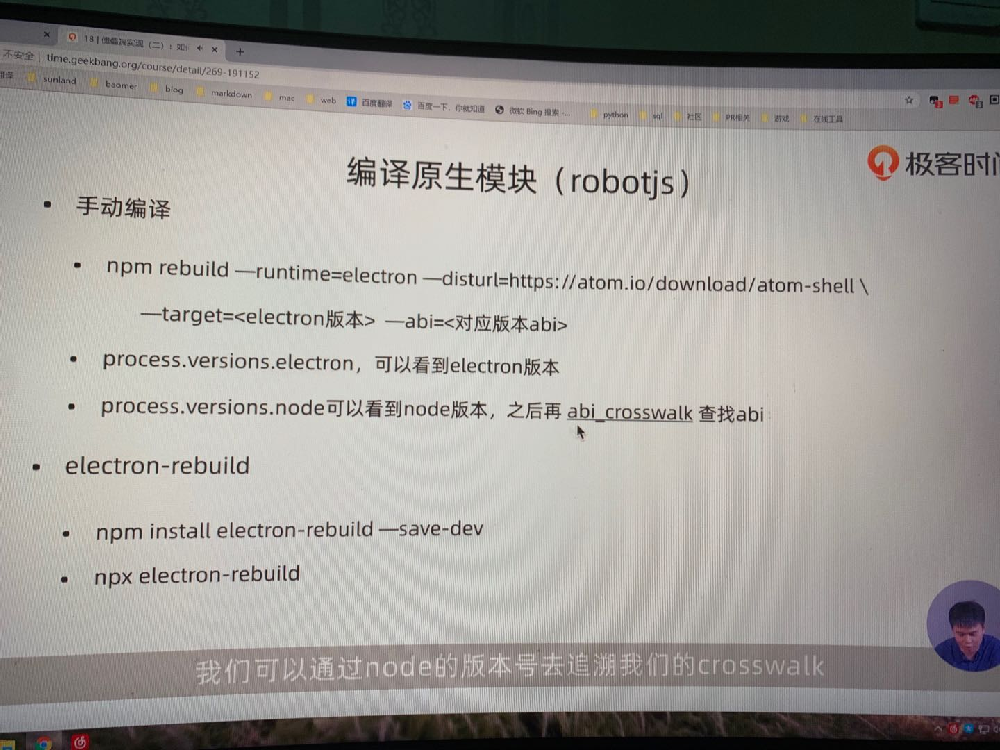

## 目录
app - 主进程
renderer - 渲染进程
websocketServer - 服务端

## 启动
根目录`npm i` => websocketServer目录`npm i` => app/renderer/src/main目录`npm i`
根目录下启动`npm start`

## 监听端口
websocketServer/index.js
`const wss = new WebSocket.Server({ port: 8010 })`

## 本地服务地址
app/main/signal.js
`const ws = new WebSocket('ws://192.168.1.105:8010')`

## robotJs编译问题
robot是c++插件需要用electron-rebuild编译
在https://github.com/mapbox/node-pre-gyp/blob/master/lib/util/abi_crosswalk.json找到node版本对应的abi
我目前的node版本是12.13.1
用npx electron-rebuild自动编译找不到对应的node版本的abi，所以运行会报错

或者通过`npm rebuild --runtime=electron --target=8.1.0 --disturl=https://atom.io/download/atom-shell --abi=72`编译

windows不识别` "start": "BROWSER=none react-app-rewired start",` BROWSER=none命令

windows安装robotJs失败，无法解析。待处理。